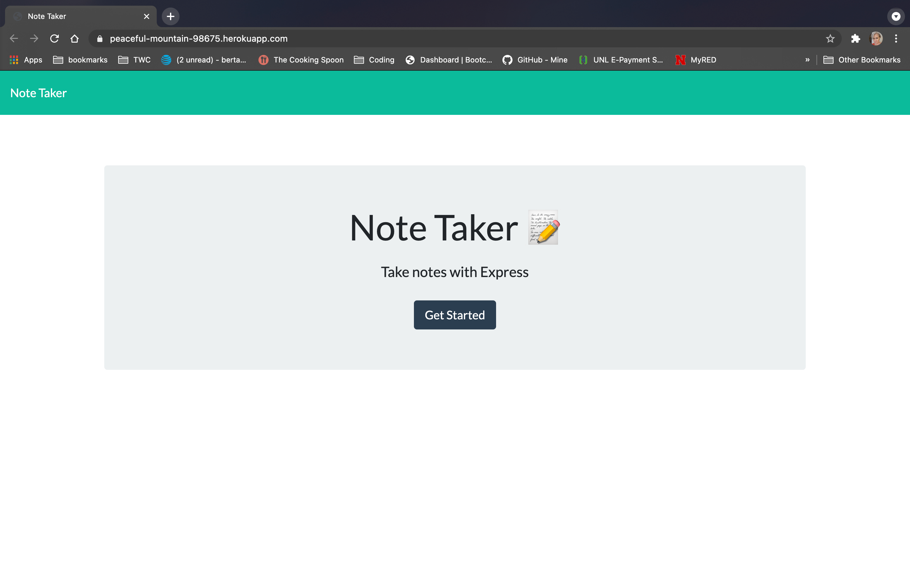
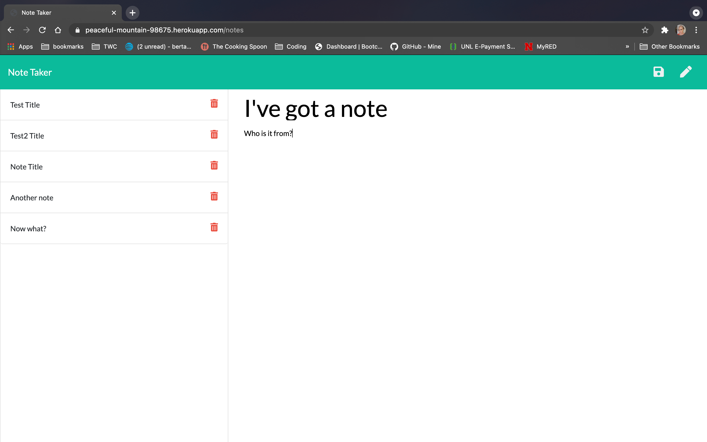

# note-taker

This application called Note Taker can be used to write and save notes. It uses an Express.js back end and will save and retrieve note data from a JSON file.

I built the back end, connected the front and back ends, and then deployed the entire application to Heroku.

## User Story

```
AS A small business owner
I WANT to be able to write and save notes
SO THAT I can organize my thoughts and keep track of tasks I need to complete
```



